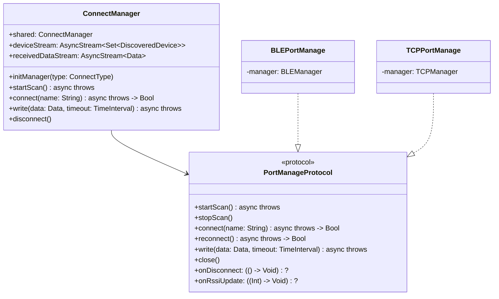

# OBDConnectLibrary Swift 迁移计划

## 1. 项目概述

将 Android `connect` 库（Kotlin）迁移到 iOS `OBDConnectLibrary`（Swift）。

### 源项目分析

| 模块 | 代码行数 | 说明 |
|------|----------|------|
| `BleManage.kt` | 2043 | BLE 蓝牙管理核心类 |
| `ClassicManager.kt` | 507 | 经典蓝牙（SPP）管理 |
| `TcpManager.kt` | 257 | TCP/IP 通信管理 |
| `ConnectManager.kt` | 384 | 统一连接入口 |
| `IPortManage.kt` | 54 | 端口管理协议接口 |
| 其他工具/模型类 | ~300 | 错误码、UUID、工具函数等 |

**总计约 3500+ 行 Kotlin 代码**

---

## 2. 平台差异与注意事项

### 2.1 iOS 限制

> [!CAUTION]
> **iOS 不支持经典蓝牙（SPP）**
> - iOS 只支持 BLE（低功耗蓝牙），不支持 `BluetoothSocket` 等经典蓝牙 API
> - `ClassicManager.kt` 和 `ClassicPortManage.kt` 无法直接迁移
> - 如果 OBD 设备使用经典蓝牙，需要使用 MFi 认证方案或更换为 BLE 模块

> [!WARNING]
> **后台蓝牙权限**
> - iOS 需要在 `Info.plist` 中声明 `UIBackgroundModes` 包含 `bluetooth-central`
> - 需要添加 `NSBluetoothAlwaysUsageDescription` 权限描述

### 2.2 框架映射对照

| Android (Kotlin) | iOS (Swift) |
|------------------|-------------|
| `BluetoothAdapter` | `CBCentralManager` |
| `BluetoothDevice` | `CBPeripheral` |
| `BluetoothGatt` | `CBPeripheral` + `CBPeripheralDelegate` |
| `BluetoothGattCharacteristic` | `CBCharacteristic` |
| `ScanCallback` | `CBCentralManagerDelegate` |
| `BroadcastReceiver` | `NotificationCenter` / Delegate |
| `Kotlin Flow` | `Combine` / `AsyncStream` |
| `suspend fun` | `async/await` |
| `Result<T>` | `Result<T, Error>` |
| `CoroutineScope` | `Task` / `TaskGroup` |

### 2.3 异步编程模型变化

```swift
// Android Kotlin
suspend fun connect(name: String): Result<Boolean>
val deviceFlow: Flow<Set<BluetoothDevice>>

// iOS Swift
func connect(name: String) async throws -> Bool
var deviceStream: AsyncStream<Set<CBPeripheral>>
// 或使用 Combine
var devicePublisher: AnyPublisher<Set<CBPeripheral>, Never>
```

---

## 3. 迁移架构设计

### 3.1 目录结构

```
OBDConnectLibrary/
├── Sources/
│   └── OBDConnectLibrary/
│       ├── Core/
│       │   ├── ConnectManager.swift          # 统一入口
│       │   ├── PortManageProtocol.swift      # 协议接口
│       │   ├── ConnectError.swift            # 错误定义
│       │   ├── ConnectState.swift            # 连接状态
│       │   └── Constants.swift               # UUID 常量
│       │
│       ├── BLE/
│       │   ├── BLEManager.swift              # BLE 核心管理
│       │   ├── BLEPortManage.swift           # BLE 端口实现
│       │   ├── BLEModels.swift               # 数据模型
│       │   └── BLEScanner.swift              # 扫描逻辑
│       │
│       ├── TCP/
│       │   ├── TCPManager.swift              # TCP 管理
│       │   └── TCPPortManage.swift           # TCP 端口实现
│       │
│       └── Utilities/
│           ├── HexDump.swift                 # 十六进制转换
│           ├── LogUtil.swift                 # 日志工具
│           └── Extensions.swift              # Swift 扩展
│
├── Tests/
│   └── OBDConnectLibraryTests/
│       ├── BLEManagerTests.swift
│       ├── TCPManagerTests.swift
│       └── MockPeripheral.swift
│
├── Package.swift
└── MigrationPlan.md
```

### 3.2 类图



---

## 4. 详细迁移步骤

### 第一阶段：基础架构 ✅ 已完成

- [x] **4.1 创建核心协议和模型**
  - `PortManageProtocol.swift` - 对应 `IPortManage.kt`
  - `ConnectError.swift` - 对应 `ErrorCode.kt`
  - `ConnectState.swift` (在 ConnectError.swift 中) - 连接状态枚举
  - `Constants.swift` - UUID 常量，对应 `LocalUUID.kt`

- [x] **4.2 创建工具类**
  - `HexDump.swift` - 对应 `HexDump.kt`
  - `LogUtil.swift` - 对应 `LogUtil.kt`

### 第二阶段：BLE 实现 ✅ 已完成

- [x] **4.3 BLE 数据模型**
  - `BLEModels.swift` - 对应 `BleModels.kt` + `BluetoothDeviceWithRssi.kt`
  - `CharacteristicProperty.swift` - 对应 `CharacteristicProperty.kt`

- [x] **4.4 BLE 管理器核心**
  - `BLEManager.swift` - 对应 `BleManage.kt` (核心属性和扫描/连接)
  - `BLEManager+Connection.swift` - RSSI监控、断开、重连
  - `BLEManager+DataTransfer.swift` - 数据分片发送与接收
  - `BLEManager+Delegates.swift` - CoreBluetooth 回调处理
  - `BLEManager+Characteristics.swift` - 特征值解析、设备信息读取
  - `BLEManager+Configuration.swift` - 配置变更方法

- [x] **4.5 BLE 端口实现**
  - `BLEPortManage.swift` - 实现 `PortManageProtocol`

### 第三阶段：TCP 实现 ✅ 已完成

- [x] **4.6 TCP 管理器**
  - `TCPManager.swift` - 对应 `TcpManager.kt`
    - 使用 `CFStream` API（兼容 iOS 12+）
    - 连接/断开/重连
    - 数据收发
    - 连接状态检测
    - 指数退避重连

- [x] **4.7 TCP 端口实现**
  - `TCPPortManage.swift` - 实现 `PortManageProtocol`

### 第四阶段：统一入口 ✅ 已完成

- [x] **4.8 ConnectManager 单例**
  - `ConnectManager.swift` - 对应 `ConnectManager.kt`
  - `VLContext` 上下文类
  - `ConnectType` 枚举
  - 统一的 BLE/TCP 连接管理接口

### 第五阶段：测试与文档 ✅ 已完成

- [x] **4.9 单元测试**
  - `ConnectManagerTests.swift` - 连接管理器测试（11 个测试）
  - `ConnectErrorTests.swift` - 错误类型测试（11 个测试）
  - `HexDumpTests.swift` - 十六进制转换测试（14 个测试）
  - `BLEModelsTests.swift` - 数据模型测试（8 个测试）
  - **共 44 个测试全部通过** ✅

- [x] **4.10 使用文档**
  - `README.md` - 完整使用指南

---

## 5. 关键代码映射示例

### 5.1 错误类型

```swift
// Swift 版本
enum ConnectError: LocalizedError {
    case bluetoothUnavailable
    case invalidName
    case connectionTimeout
    case connecting
    case noCompatibleDevices
    case sendTimeout
    case receiveTimeout
    case scanFailed(underlying: Error?)
    case connectionFailed(underlying: Error?)
    case sendFailed(underlying: Error?)
    case receiveFailed(underlying: Error?)
    case invalidData
    case notConnected
    case unknown
    
    var errorDescription: String? {
        switch self {
        case .bluetoothUnavailable: return "Bluetooth is currently unavailable"
        case .invalidName: return "Invalid input parameter"
        // ... 其他情况
        }
    }
}
```

### 5.2 协议接口

```swift
// Swift 版本
protocol PortManageProtocol {
    var onDisconnect: (() -> Void)? { get set }
    var onBluetoothStateDisconnect: (() -> Void)? { get set }
    var onRssiUpdate: ((Int) -> Void)? { get set }
    
    func startScan() async throws
    func stopScan()
    func connect(name: String) async throws -> Bool
    func reconnect() async throws -> Bool
    func close()
    func write(data: Data, timeout: TimeInterval) async throws
    
    var deviceStream: AsyncStream<Set<DiscoveredDevice>> { get }
    var receivedDataStream: AsyncStream<Data> { get }
}
```

### 5.3 BLE 扫描示例

```swift
// Swift 版本
class BLEManager: NSObject, CBCentralManagerDelegate {
    private var centralManager: CBCentralManager!
    private var discoveredDevices: Set<DiscoveredDevice> = []
    private var deviceContinuation: AsyncStream<Set<DiscoveredDevice>>.Continuation?
    
    lazy var deviceStream: AsyncStream<Set<DiscoveredDevice>> = {
        AsyncStream { continuation in
            self.deviceContinuation = continuation
        }
    }()
    
    func startScan() async throws {
        guard centralManager.state == .poweredOn else {
            throw ConnectError.bluetoothUnavailable
        }
        discoveredDevices.removeAll()
        centralManager.scanForPeripherals(withServices: nil, options: [
            CBCentralManagerScanOptionAllowDuplicatesKey: true
        ])
    }
    
    func centralManager(_ central: CBCentralManager,
                       didDiscover peripheral: CBPeripheral,
                       advertisementData: [String: Any],
                       rssi RSSI: NSNumber) {
        let device = DiscoveredDevice(
            peripheral: peripheral,
            rssi: RSSI.intValue,
            advertisementData: advertisementData
        )
        discoveredDevices.update(with: device)
        deviceContinuation?.yield(discoveredDevices)
    }
}
```

---

## 6. 注意事项清单

### 6.1 必须处理的差异

| 问题 | Android 行为 | iOS 解决方案 |
|------|-------------|-------------|
| 蓝牙状态监听 | BroadcastReceiver | CBCentralManagerDelegate `centralManagerDidUpdateState` |
| 后台扫描 | Service | Background Modes + State Restoration |
| 设备 ID | MAC 地址 | UUID（每次配对可能变化） |
| 自动重连 | BluetoothDevice.connectGatt | 需要手动实现，缓存 peripheral |
| MTU 协商 | requestMtu() | 系统自动协商，iOS 14+ 可查询 |

### 6.2 iOS 特有问题

1. **设备标识符**
   - Android 使用 MAC 地址，可以持久化保存
   - iOS 使用 `CBPeripheral.identifier`（UUID），在不同设备上可能不同
   - 建议：使用设备名称 + 服务 UUID 组合来识别设备

2. **后台运行**
   - 需要在 `Info.plist` 添加 `UIBackgroundModes: bluetooth-central`
   - 后台扫描时需要指定 service UUID
   - 建议实现 State Restoration

3. **权限管理**
   - iOS 13+: 需要 `NSBluetoothAlwaysUsageDescription`
   - iOS 需要先获取授权才能使用蓝牙

### 6.3 待确认事项

> [!IMPORTANT]
> 请确认以下问题：
> 
> 1. **OBD 设备类型**：目标 OBD 设备是 BLE 还是经典蓝牙？
>    - 如果是经典蓝牙，iOS 无法直接支持
> 
> 2. **最低 iOS 版本**：当前设置为 iOS 13，是否需要调整？
>    - iOS 13+: 支持 Combine
>    - iOS 15+: 支持更好的 async/await
> 
> 3. **TCP 功能是否需要**：WiFi-OBD 设备是否在使用范围内？
> 
> 4. **是否需要 ObjC 兼容**：是否需要 `@objc` 导出供 ObjC 项目使用？

---

## 7. 工作量估算

| 阶段 | 预计时间 | 优先级 |
|------|----------|--------|
| 基础架构 | 2-3 小时 | P0 |
| BLE 实现 | 4-6 小时 | P0 |
| TCP 实现 | 1-2 小时 | P1 |
| 统一入口 | 1 小时 | P0 |
| 单元测试 | 2 小时 | P1 |
| 文档 | 1 小时 | P2 |

**总计：11-15 小时**

---

## 8. 验证计划

### 8.1 单元测试

```bash
# 运行所有测试
swift test

# 运行特定测试
swift test --filter BLEManagerTests
```

### 8.2 手动测试

1. **BLE 扫描测试**
   - 启动扫描，确认能发现周围 BLE 设备
   - 检查设备名称、RSSI 是否正确显示

2. **BLE 连接测试**
   - 连接到 OBD 设备
   - 验证服务发现是否成功
   - 验证特征值读写

3. **数据收发测试**
   - 发送 OBD 命令
   - 验证响应数据

---

## 9. 参考资源

- [Core Bluetooth Programming Guide](https://developer.apple.com/library/archive/documentation/NetworkingInternetWeb/Conceptual/CoreBluetooth_concepts/AboutCoreBluetooth/Introduction.html)
- [Network.framework Documentation](https://developer.apple.com/documentation/network)
- [Swift Concurrency](https://docs.swift.org/swift-book/documentation/the-swift-programming-language/concurrency/)
